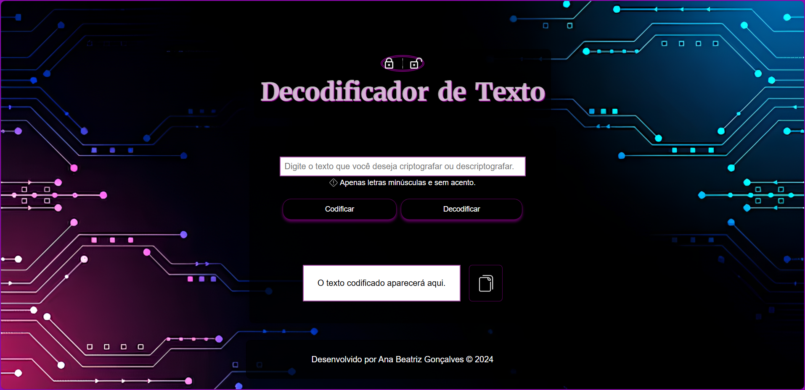

# Decodificador de Texto

Um projeto básico para criptografar e descriptografar textos utilizando um método específico de codificação.

## Índice

- [Descrição](#descrição)
- [Como usar](#como-usar)
- [Tecnologias Utilizadas](#tecnologias-utilizadas)
- [Acesse o Projeto](#acesse-o-projeto)

## Descrição

O Decodificador de Texto é uma iniciativa proposta pela Alura, com a finalidade de possibilitar aos usuários codificar e decodificar mensagens utilizando uma técnica de substituição básica. Foi desenvolvido com base no conhecimento adquirido nos cursos oferecidos na formação para iniciantes em programação com JavaScript.

## Como Usar

1. **Codificar Texto:**

- Digite o texto que deseja codificar na área indicada.
- Clique no botão "Codificar".
- O texto codificado aparecerá na seção de saída.

2. **Decodificar Texto:**

- Digite o texto que deseja decodificar na área de texto.
- Clique no botão "Decodificar".
- O texto decodificar aparecerá na seção de saída.

3. **Copiar Resultado:**

- Clique no botão ao lado do resultado, com o simbolo "copiar" para copiar o texto resultante para a área de transferência.

4. **Seguir os requisitos**

- Nota: Apenas letras minúsculas e sem acentos são permitidas.

## Tecnologias Utilizadas

- HTML: Estrutura do layout da página.
- CSS: Estilização da página e responsividade.
- JavaScript: Lógica para criptografar e descriptografar o texto.

## Acesse o Projeto

Você pode acessar o projeto em: https://decodificador-de-texto-b.vercel.app/
